# 🚆 Surf nos Trilhos — jogo de corrida infinita 3D no navegador

[](https://alequizao.com/surf/)


**Surf nos Trilhos** é um jogo de corrida infinita (*endless runner*) em 3D, no estilo Subway Surfers, que roda direto no navegador do celular ou do computador — sem instalar, sem cadastro e de graça. Você corre pelos trilhos de uma cidade litorânea inspirada em **Maceió (AL)**, com prédios, coqueiros e muros grafitados, desvia dos trens, pega moedas e poderes e foge do vigia e do cachorro dele.

👉 **Jogue em: [alequizao.com/surf](https://alequizao.com/surf/)**

<p align="center">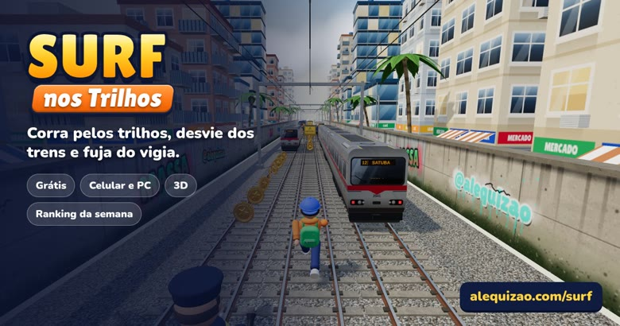</p>

## 📸 Telas do jogo

| Menu | Corrida |
|:---:|:---:|
| 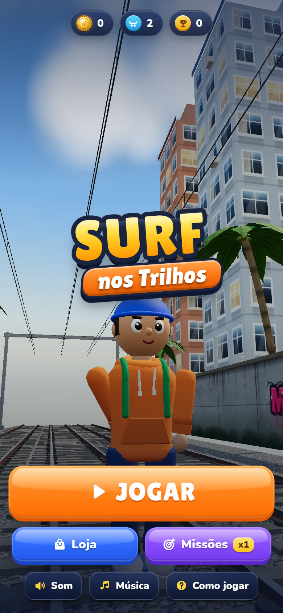 | 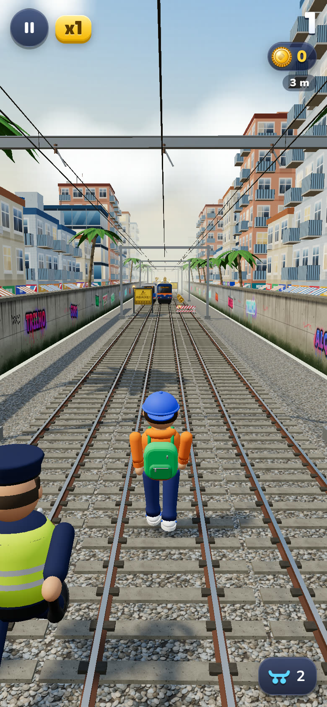 |
| **Trens parados** | **Jetpack em cima dos trens** |
| 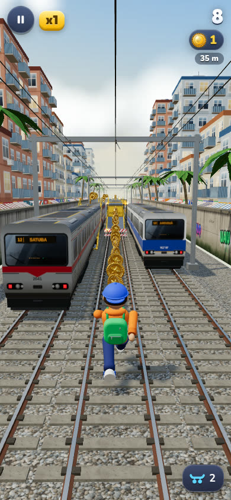 | 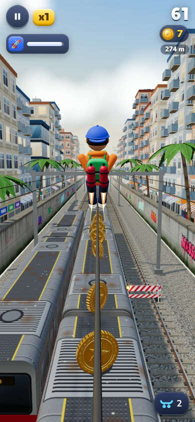 |

<details>
<summary><b>Mais telas</b> (trem na contramão, obstáculos, loja, missões, personagens, desktop)</summary>

| Trem vindo | Barreiras |
|:---:|:---:|
| 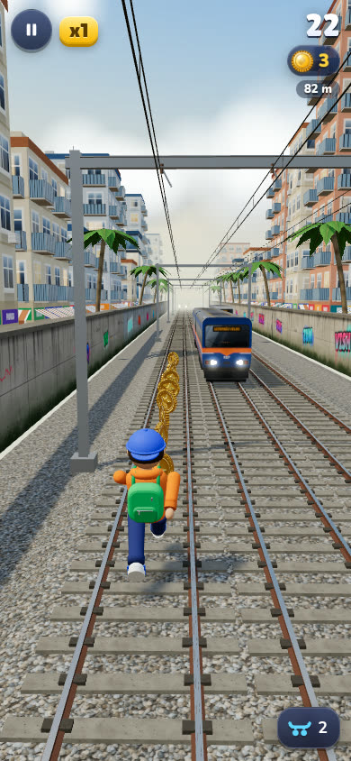 | 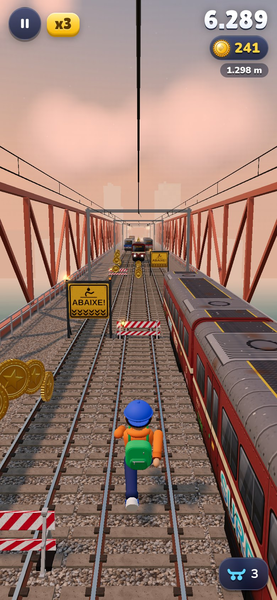 |
| **Rampa** | **Como jogar** |
| 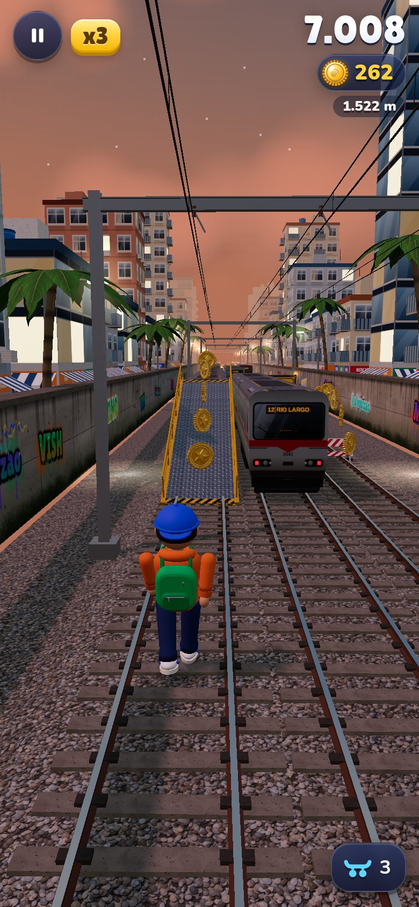 | 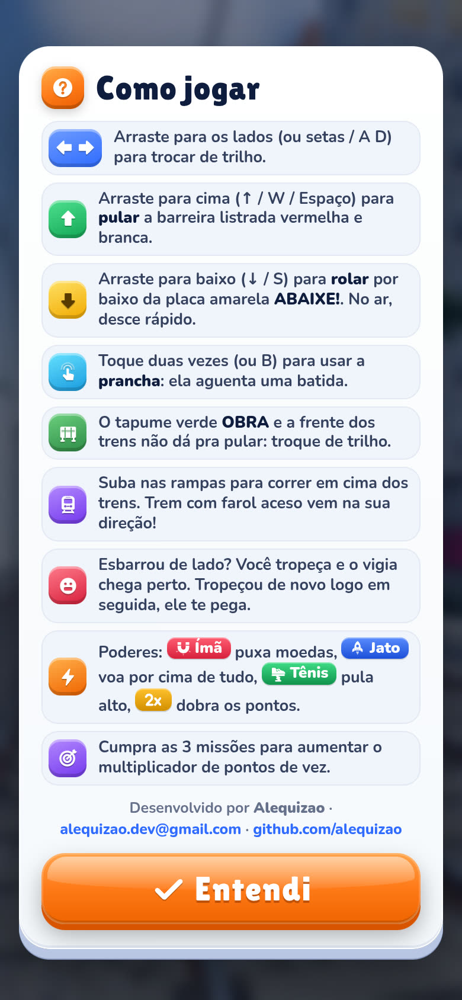 |
| **Loja de personagens** | **Missões** |
| 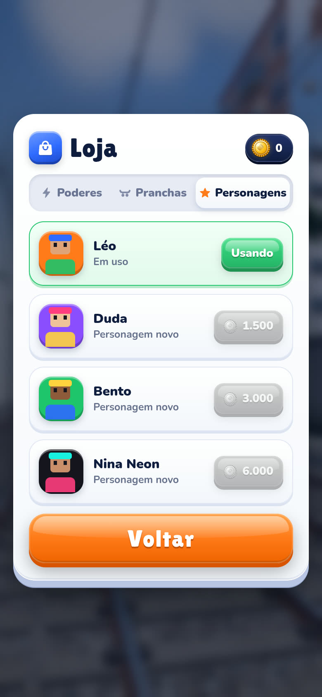 | 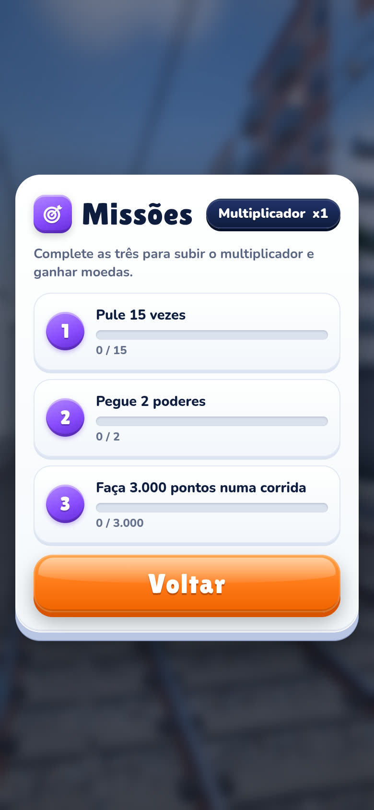 |

| Personagens | Moedas e poderes |
|:---:|:---:|
| 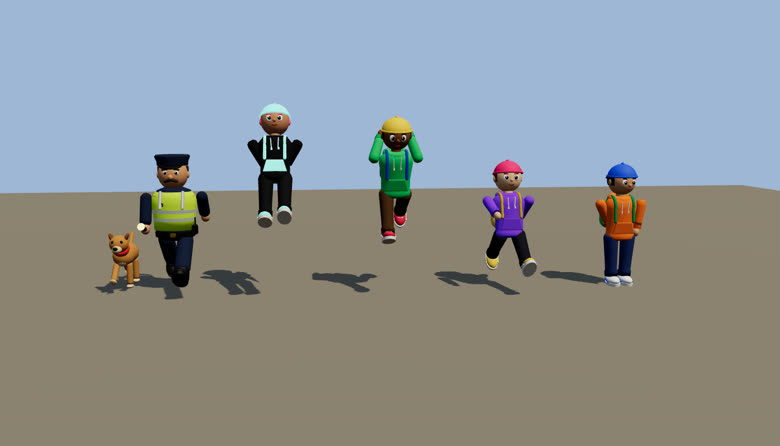 | 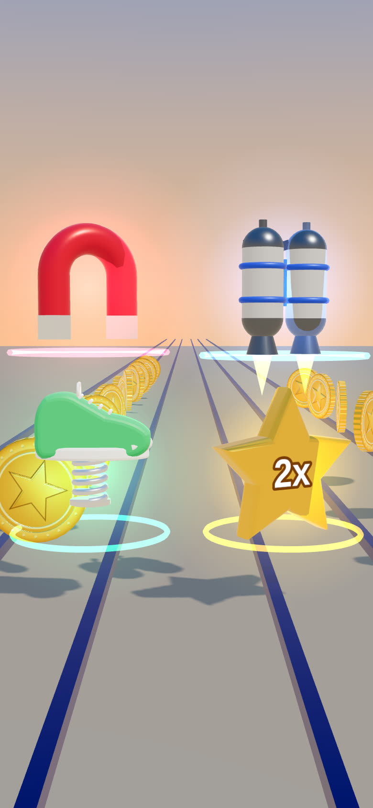 |

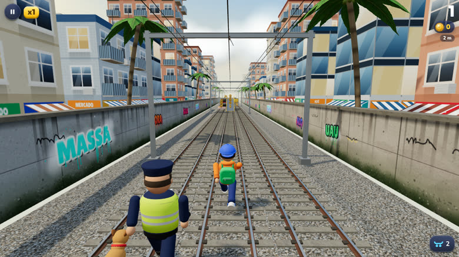
</details>

## 🎮 Como jogar

| Ação | Celular | Teclado |
|---|---|---|
| Trocar de trilho | deslizar para os lados | ← → / A D |
| Pular | deslizar para cima | ↑ / W / Espaço |
| Rolar (no ar: descer rápido) | deslizar para baixo | ↓ / S |
| Usar prancha (aguenta uma batida) | toque duplo | B / Shift |
| Pausar | botão ❚❚ | Esc / P |

## ✨ Recursos

- 🌦️ **Clima que muda sozinho** — sol, nublado e chuva (gotas, trilho molhado e som), junto com o ciclo dia/noite, túnel e ponte.

  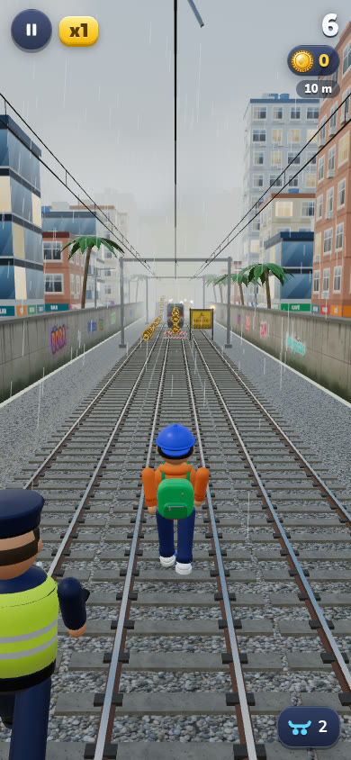

- 🏆 **Ranking online:** ao perder, salve o placar com o nome ou o @ do Instagram e veja a posição (PHP + SQLite; o banco fica fora do repositório).
- 🚇 **Túnel do Farol e ponte sobre a Lagoa Mundaú**, pista sempre com saída e continuar ilimitado com moedas.
- **Cenário 3D realista:** sombras em tempo real, céu com nuvens e reflexos (PBR + environment map), trilhos de aço com brita e dormentes de concreto, muros grafitados, prédios com sacadas e caixas d'água, coqueiros e rede elétrica.
- **Trens** em 4 pinturas com letreiro LED (Maceió, Jaraguá, Bebedouro, Rio Largo, Fernão Velho, Satuba); trens na contramão com farol aceso.
- **Obstáculos:** barreira listrada (pular), placa ABAIXE! (rolar), tapume de obra (desviar), rampas para correr em cima dos vagões.
- **Poderes:** ímã de moedas, jetpack, tênis mola e pontos 2x — com níveis na loja.
- **Loja:** personagens (Léo, Duda, Bento, Nina Neon), pranchas e melhorias.
- **Missões** com multiplicador de pontos permanente.
- **Som e trilha** sintetizados com WebAudio.
- **PWA:** instala como app e funciona offline.
- **Qualidade adaptativa:** reduz resolução e sombras em aparelhos mais fracos.

## 🛠️ Tecnologia

- [Three.js](https://threejs.org/) r170 (WebGL), sem build — ES modules puros.
- Todas as texturas são desenhadas por código (canvas), sem imagens externas.
- Service worker com cache versionado.

| Arquivo | O que faz |
|---|---|
| `index.html` | telas, HUD, sprite de ícones SVG, SEO |
| `jogo.js` | regras, física, geração da pista, cenário, câmera, loja, missões, áudio |
| `personagens.js` | corredores, vigia e cachorro |
| `objetos.js` | trens, rampa e obstáculos |
| `itens.js` | moedas e poderes |
| `icones.js` | helper dos ícones SVG |
| `estilo.css` | interface |
| `sw.js` / `manifest.webmanifest` | PWA offline |

### Rodar localmente

```bash
git clone https://github.com/alequizao/surf-nos-trilhos.git
cd surf-nos-trilhos
python3 -m http.server 8080
# abra http://localhost:8080
```

> A cada publicação, suba a versão (`?v=`) em `index.html`, nos `import` dos módulos, em `sw.js` (`VERSAO` e lista) e em `jogo.js`.

## 👨‍💻 Desenvolvedor

Jogo desenvolvido por **Alequizao**.

- **E-mail:** alequizao.dev@gmail.com
- **GitHub:** [@alequizao](https://github.com/alequizao)
- **Site:** [alequizao.com](https://alequizao.com/)

Quer um jogo ou sistema como este? Entre em contato.

---

© 2026 Alequizao · Todos os direitos reservados. Personagens, nome e visual próprios — sem relação com Subway Surfers ou SYBO.
Uso, cópia ou redistribuição somente com autorização. Three.js é distribuído sob a licença MIT pelos seus autores.
